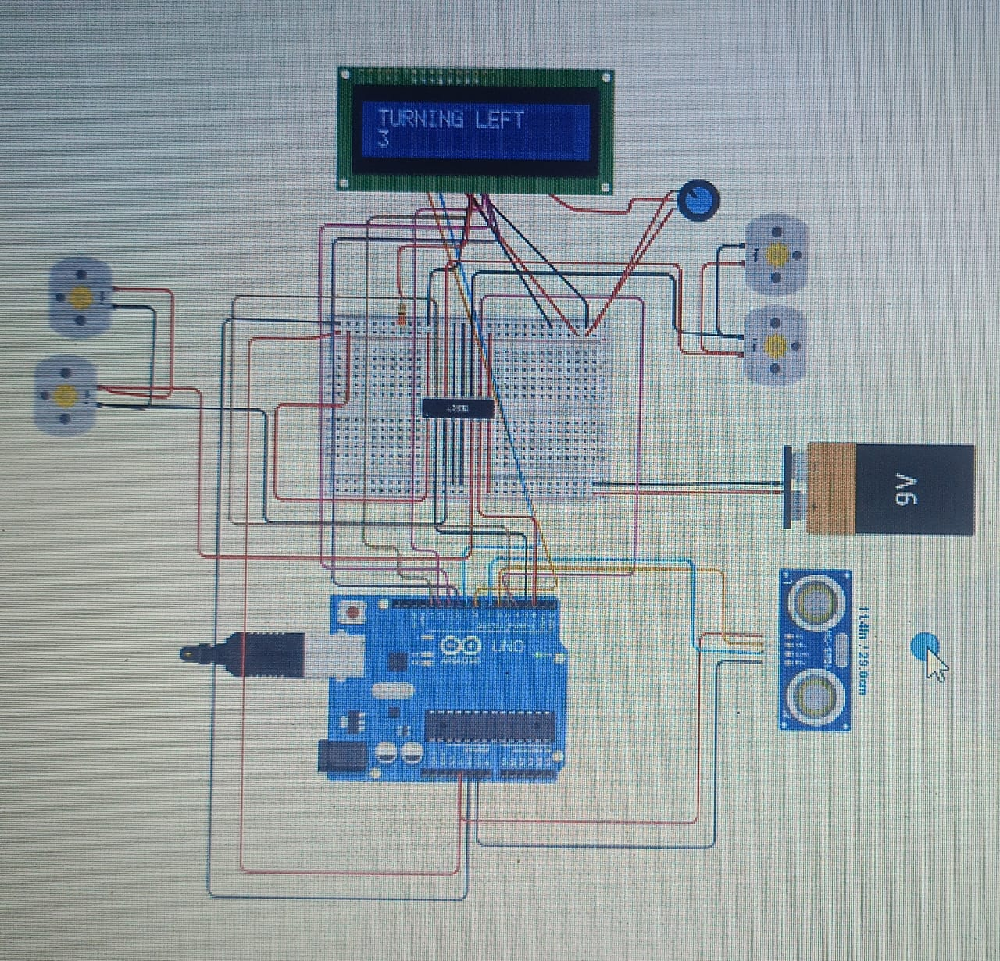

# obstacle-avoiding-robot
an autonomous robot that detects obstacles in path and navigates around them without any human intervention
An Obstacle Avoiding Robot is an autonomous robotic vehicle that detects obstacles in its path and automatically changes direction to avoid collisions. This project uses an ultrasonic sensor to measure the distance between the robot and nearby objects.

📌 Features
Automatic obstacle detection
Collision avoidance
Autonomous movement
Ultrasonic distance measurement
Simple and low-cost hardware
Suitable for robotics and embedded-systems projects

## Circuit Diagram

## Components Required
- Arduino UNO
- HC-SR04 Ultrasonic Sensor
- 16x2 LCD Display
- L293D Motor Driver IC
- 4x BO Motors
- 9V Battery
- Breadboard, Potentiometer, Jumper Wires

## How It Works
1.  Ultrasonic sensor measures distance
2.  If distance < 20cm, robot stops, goes back, and turns left
3.  Otherwise, moves straight
4.  LCD displays status like "TURNING LEFT", "BREAK FOR TURN"

## Arduino Code
Check `Obstacle_Avoiding_Robot.ino` file

## Tinkercad Simulation
Made in Tinkercad Circuits

## Created By
Saikumar - 2026

